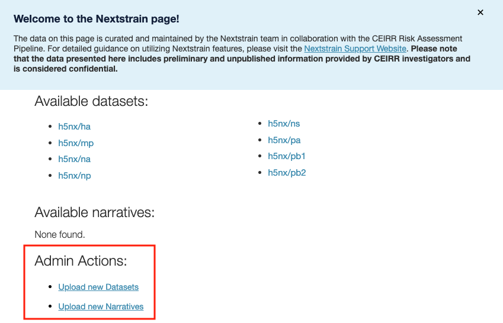

# nextstrain-ceirr

Nextstrain phylogenetic pipeline for [CEIRR](https://www.ceirr-network.org/) that integrates phenotypic characterization data with H5NX genomic sequences for Auspice visualization.

## Overview

This pipeline combines:

- **Genomic data**: H5 sequences and metadata from `h5-data-updates/`
- **Phenotypic data**: Characterization results submitted via Google Form, downloaded as Excel

The phenotypic data includes receptor binding, pathogenesis, transmission, and antiviral sensitivity results from CEIRR collaborators.

## Directory Structure

```
nextstrain-ceirr/
├── ceirr/                      	# Core pipeline module
├── maintenance_data/           	# Maintainer-curated lookup tables (see below)
├── h5-data-updates/            	# Cloned repo: shared H5 sequence data
├── nextstrain_hpai_north_america/  # Cloned repo: GenoFlu + avian species logic
├── config/                     	# References, strain lists, auspice config
├── data/                       	# Working directory (generated + input spreadsheet)
└── Snakefile                   	# Pipeline definition
```

## Maintainer Workflow

### When Phenotypic Data Changes

1. **Download the spreadsheet** from Google Sheets:
   - Go to the `nextstrain-ceirr` Slack channel, look at the pin, and follow the link to the shared Google sheet
   - Download using File → Download → Microsoft Excel (.xlsx)
   - Copy the downloaded file into the `data/` directory and rename it to `metadata.xlsx` (the pipeline expects this exact filename)

2. **Run the pipeline**:

   ```bash
   snakemake -j8 all  # Eight segments at once
   ```

3. **Check validation output** - the pipeline prints warnings:

   ```
   === Strain Cross-Reference Validation ===
   MATCHED (28/40):
     A/Chile/25945/2023 → A/Chile/25945/2023
     ...
   UNMATCHED (12/40) - add to maintenance_data/strain_crossref.tsv:
     A/Texas/37/2024
     ...

   === Source String Validation ===
   MATCHED (19/19):
     ...
   ```

4. **Fix any UNMATCHED entries** (see sections below)

5. **Re-run and verify** all strains/sources match

6. **Run full pipeline**:

   ```bash
   snakemake -j4 all
   ```

### Adding a New Strain

When a strain appears in UNMATCHED, you need to map the Google Sheet name to the ML database name.

1. Find the strain in the tree/database to get the canonical name
2. Add a row to `maintenance_data/strain_crossref.tsv`:

   ```
   A/Texas/37/2024	A/Texas/37/2024
   ```

   Note: Names often differ in spacing, abbreviations, or special characters:

   ```
   A/WA/255/2024	A/Washington/255/2024
   A/bald eagle/Florida/W22-134-OP/2022 (Eagle/FL/22)	A/baldeagle/Florida/W22134OP/2022
   ```

### Adding a New Source

When a source string appears in UNMATCHED:

1. Add the exact string to `maintenance_data/source_strings.tsv` with source ID(s):

   ```
   New Author et al., Journal 2024	22
   Penn-CEIRR and Emory-CEIRR	7,8
   ```

2. If the source ID is new, also add to `maintenance_data/sources.tsv`:

   ```
   22	New Author et al., Journal 2024	https://doi.org/...
   ```

   Leave URL empty for CEIRR center attributions (no publication link).

## Maintenance Data Files

### `maintenance_data/strain_crossref.tsv`

Maps strain names from Google Sheet → ML database. Required because collaborators often use abbreviated or variant strain names.

| Column | Description |
|--------|-------------|
| `google_sheet_metadata_strain` | Strain name as entered in Google Form |
| `ml_database_strain` | Canonical name in ML database/tree |

### `maintenance_data/source_strings.tsv`

Maps exact source strings from spreadsheet → source IDs. Handles combined citations and typo variants.

| Column | Description |
|--------|-------------|
| `source_string` | Exact string from "Source Preference/Publication" column |
| `source_ids` | Comma-separated IDs referencing sources.tsv |

### `maintenance_data/sources.tsv`

Source details for Auspice display.

| Column | Description |
|--------|-------------|
| `source_id` | Integer ID |
| `name` | Display name in Auspice |
| `url` | Publication URL (empty for CEIRR communications) |

## Installation

[Install and configure Bioconda](https://bioconda.github.io/).

Clone and set up dependencies:

```bash
git clone https://github.com/moncla-lab/nextstrain-ceirr
cd nextstrain-ceirr

# Clone dependencies at tested commits
git clone https://github.com/moncla-lab/h5-data-updates.git
cd h5-data-updates && git checkout 0971472333e4711b2c934d670f2c4fadc87461aa && cd ..

git clone https://github.com/moncla-lab/nextstrain-hpai-north-america.git nextstrain_hpai_north_america
cd nextstrain_hpai_north_america && git checkout 5f9b6f3dcb7f203cec43534e816920745b12adf8 && cd ..
```

Create the conda environment from the included `environment.yml`:

```bash
conda env create -f environment.yml
conda activate nextstrain-ceirr
```

## Running the Pipeline

```bash
# Full pipeline
snakemake -j4 all

# Single segment (faster for testing)
snakemake -j4 data/ml/h5nx_ha.json

# View results
nextstrain view data/ml
```

### Dev Mode

For faster iteration, edit `SEQUENCES_PER_GROUP` at the top of `Snakefile`:

```python
SEQUENCES_PER_GROUP = 2   # Dev: fast iteration
SEQUENCES_PER_GROUP = 15  # Prod: full dataset
```

## Updating Dependencies

When upstream data changes, pull the latest:

```bash
cd h5-data-updates && git pull && cd ..
cd nextstrain_hpai_north_america && git pull && cd ..
```

### Dependencies

- **h5-data-updates**: H5 sequences, metadata, and CEIRR spreadsheet URL
- **nextstrain\_hpai\_north\_america**: GenoFlu processing and species/flyway mappings

## Uploading Results

1. Sign in to the [CEIRR web application](https://app.ceirr-network.org/)
2. Select the **Nextstrain** tab from the left sidebar
   
3. Under **Admin Actions**, click **Upload new Datasets**
   
4. Drag and drop the JSON files from `data/ml/` into the upload area
5. Initiate the upload
